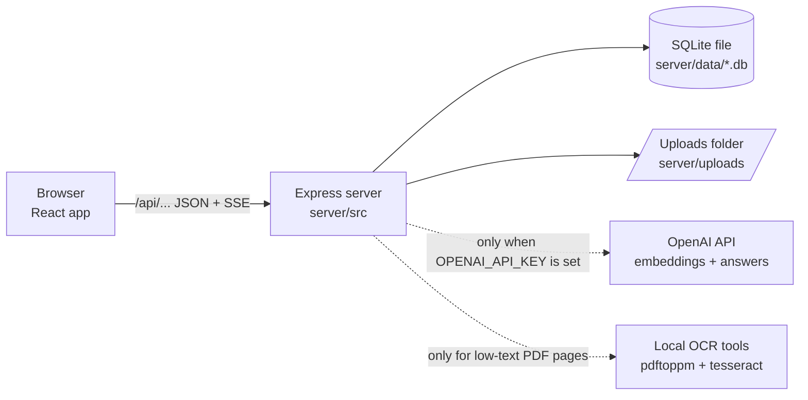
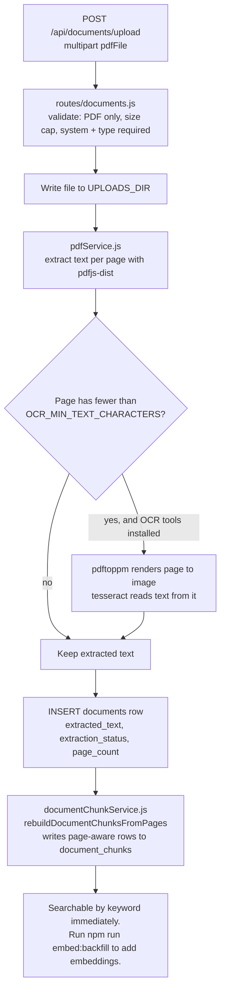
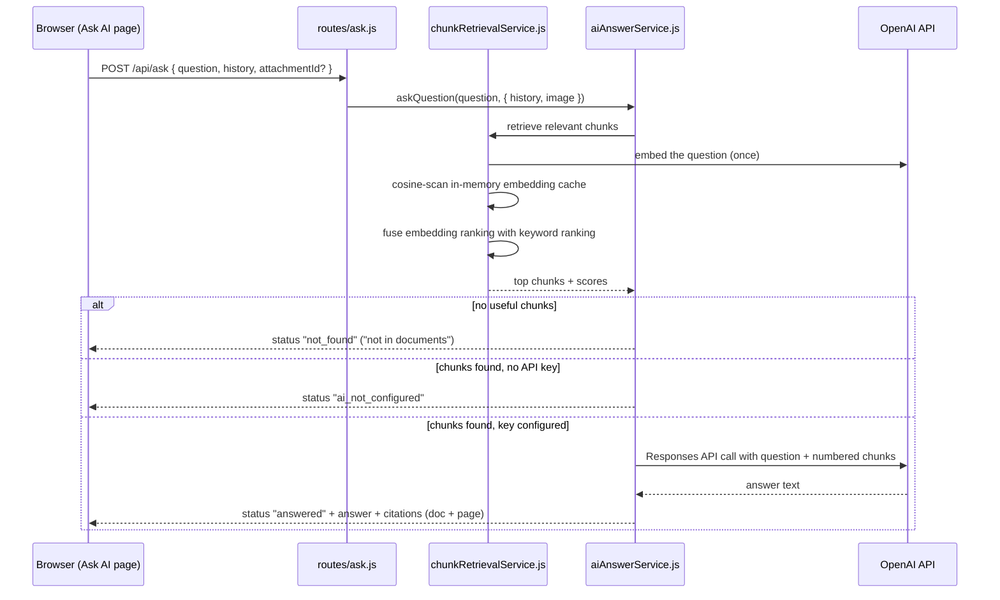
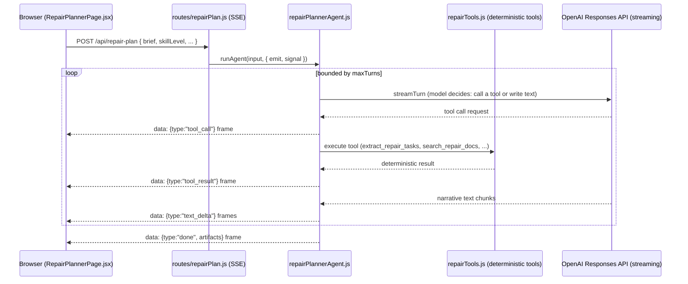

# Architecture

This document explains how Corolla Fix Helper is put together: what runs where, how data flows through the app, which files matter, and why the design is the way it is. It is written for a beginner — terms are explained the first time they appear.

Related docs: [API reference](api.md) · [Data model](../DATA_MODEL.md) · [Repair Planner internals](repair-planner.md) · [Onboarding guide](onboarding.md)

## The Big Picture

The repo has two main parts plus local storage:

```text
client/   React frontend (what you see in the browser)
server/   Express backend, SQLite database setup, API routes, uploads folder
```



The app is **local-first**:

- App records (documents, symptoms, procedures, notes, settings) live in one SQLite database file.
- Uploaded PDFs and attachment images live in a local folder.
- The browser talks to the backend only through `/api/...` routes.

Storage remains local-first, but document Q&A is not fully offline when `OPENAI_API_KEY` is configured: `/api/ask` then depends on OpenAI uptime and network latency for query embeddings and answer generation. Without a key, everything else still works and the AI features degrade to an "AI not configured" state.

## Runtime

The backend requires Node.js `>=24 <25` because it uses Node's **built-in** `node:sqlite` module — no SQLite npm package is installed.

During local development (`npm run dev`):

- frontend dev server: `http://localhost:5173` (Vite, with hot reload)
- backend: `http://localhost:4000`
- Vite proxies every `/api` request from 5173 to 4000 (see `client/vite.config.js`), so the frontend code just calls relative URLs like `/api/documents`.

In a production-style run:

- `npm run build` builds the frontend into `client/dist`
- `npm start` starts the backend, and Express serves the built frontend from `client/dist` at `http://localhost:4000` (see `addFrontendRoutes` in `server/src/app.js`)

## Responsibilities

### Client (`client/`)

React 19 + React Router 7 + Tailwind CSS 4. The pattern is simple and repeated:

- One page component per feature under `client/src/pages/` (Dashboard, Documents, Ask AI, Repair Planner, Symptoms, Procedures, Notes, Settings). Routes are wired in `client/src/App.jsx`. Note the "Ask AI" page keeps its historical `/search` route and `SearchPage.jsx` filename — it holds the Ask panel plus the keyword-search sections.
- Shared presentational pieces under `client/src/components/` (e.g. `documents/DocumentsList.jsx`, `search/ResultCards.jsx`).
- `client/src/lib/apiClient.js` is a thin `fetch` wrapper (`requestJson`) plus helpers for attachments and symptom↔procedure links.
- Tests are co-located next to the code (`*.test.jsx`, Vitest + jsdom + Testing Library).

The client holds no data of its own — every page fetches from the API on load.

### Server (`server/`)

ES modules throughout. The layering rule:

- `server/src/index.js` — starts the app (reads the port, listens).
- `server/src/app.js` — `createApp(options)` builds the Express app: CORS, JSON parsing, all `/api` routers, the rate limiter on the AI endpoints, and static serving of `client/dist`.
- `server/src/routes/` — **thin** HTTP handlers: parse/validate input, call a service, shape the JSON response.
- `server/src/services/` — the actual logic (extraction, chunking, retrieval, answering, backup...).
- Routes own HTTP-specific work: parsing and validating requests, choosing status codes, and shaping response/error behavior. Dedicated entity services own entity operations, database writes, and the canonical row shapes returned by those routes.
- `server/src/services/vehicleService.js` owns the single-vehicle lookup (`getVehicle` and `getVehicleId`). Routes and other services use it instead of repeating the "first vehicle row" query, so a future multi-vehicle change has one lookup seam.
- `server/src/services/documentService.js`, `symptomService.js`, `procedureService.js`, and `noteService.js` own the corresponding entity operations and row mapping. `server/src/services/searchService.js` owns keyword search and reuses the exported entity mappers for its result shapes.
- `symptomService.js` exports `mapSymptomCore`, and `procedureService.js` exports `mapProcedureCore`. These shared cores contain the common entity fields and linked-document projection; the full API mappers add their one cross-entity link set. Search must reuse these exports (and `noteService.js`'s `mapNoteRow`) rather than duplicating row mapping.
- `server/src/config.js` — the **only** place environment variables are read. Everything else imports `config`.
- `server/src/initDatabase.js` — creates and migrates the SQLite schema on startup via a `schema_migrations` table (numbered migrations, each applied exactly once, transactional).

### Storage

- SQLite database file: `DATABASE_FILE`, default `server/data/corolla-fix-helper.db`
- Uploaded PDFs: `UPLOADS_DIR`, default `server/uploads/`
- Attachment images: `UPLOADS_DIR/attachments/images/` (inside the uploads tree so backups capture them automatically)
- `document_chunks` table: page-aware text chunks with Float32 embedding BLOBs for document Q&A
- Backup export: one `.tar.gz` containing the database and the whole uploads tree

Table-by-table details: [DATA_MODEL.md](../DATA_MODEL.md).

**Delete cleanup is a hard rule:** deleting a document must remove its `symptom_documents`, `procedure_documents`, and `document_chunks` rows, clear note links, and delete the stored file. Symptom/procedure/note deletes similarly remove their attachment rows and image files (the polymorphic `attachments` table has no `ON DELETE CASCADE`, so services do it explicitly).

## The Dependency-Injection Convention (important for tests)

The repo deliberately avoids heavy dependencies: **there is no OpenAI SDK and no agents framework**. OpenAI calls are raw `fetch` against the Responses/Embeddings APIs, and every external dependency is injectable:

- `createApp({ askQuestion, runRepairPlan, aiRateLimiter })` — the routes accept replacement implementations
- `runRepairPlannerAgent(..., { streamTurn })` — the agent accepts a mock model client
- `loadAttachmentImageFromStorage(id, { getAttachment, readImageFile })` — even file reads are injectable

This is why **all tests run without an API key and make no network calls**. Any new AI-touching code must follow the same pattern: take the external call as an injectable parameter with the real implementation as the default.

## Data Flow 1: PDF Upload and Extraction



Key points:

- OCR is **local** (Poppler `pdftoppm` + Tesseract), never OpenAI. If the tools are missing, text PDFs still work; scanned PDFs get an extraction status starting with `ocr_unavailable:`.
- If anything fails mid-upload, the route deletes the written file and the partially-created rows before returning an error.
- Re-running extraction (`POST /api/documents/:id/extract`) runs the same pipeline on the stored file and rebuilds that document's chunks.
- The bulk importer (`server/src/scripts/importFolder.js`, `npm run import`) uses this same storage model. It is resumable: it skips duplicates by MD5 hash first and original filename second, keeps going after corrupt files, and reports imported / skipped / failed / `IMAGE-ONLY` counts.

## Data Flow 2: "Ask your documents" (RAG)

RAG means retrieval-augmented generation: the server *retrieves* relevant document text first, then asks an AI model to answer *using only that text*.



The pipeline, file by file:

1. `server/src/services/documentChunkService.js` — writes page-aware chunks into `document_chunks` at upload/extraction time.
2. `npm run embed:backfill` (`server/src/scripts/embedBackfill.js` → `chunkEmbeddingService.js`) — stores OpenAI embeddings on chunks that don't already have the active embedding version. Versions are stored as `model@dimensions` (e.g. `text-embedding-3-small@512`); retrieval **ignores** chunks whose version doesn't match the current config, so changing the model requires a re-backfill but never mixes incompatible vectors.
3. `server/src/services/chunkRetrievalService.js` — embeds the question once, cosine-scans an **in-memory cache** of chunk embeddings, and fuses that ranking with keyword ranking (hybrid retrieval). There is no vector database and no SQLite vector extension.
4. `server/src/services/aiAnswerService.js` — builds citations and, when a key is set, calls the OpenAI Responses API with raw `fetch`.
5. `server/src/routes/ask.js` — exposes `POST /api/ask` (question capped at 2000 characters; rate-limited to 20/min).

The refusal path is a feature, not an error: when the documents don't contain the answer, the response is `not in documents` instead of a guess. `npm run eval:answers` tests exactly this ([quality-testing.md](quality-testing.md)).

### Optional LLM reranker (off by default)

`server/src/services/chunkRerankService.js` adds an optional second pass over the fused results. It is off by default (`RERANK_ENABLED=false`). When enabled, retrieval over-fetches a wider pool (`RERANK_CANDIDATE_LIMIT`, default 20), asks the model **only** to reorder chunk numbers (never to generate answer content), validates the reply defensively, and slices to the requested limit. Every failure mode — disabled, no key, malformed reply, network error — falls back to the original fusion order, so Ask never fails because reranking failed. `npm run eval:rerank` A/B-compares fusion-only vs reranked retrieval.

### Optional image in Ask (Vision Ask)

`POST /api/ask` accepts an optional `attachmentId` pointing at one **already-saved** image attachment (a symptom/procedure/note photo). The client never uploads a new file here and never sends raw image data; the backend loads the stored file (`loadAttachmentImageFromStorage` in `routes/ask.js`, injectable for tests) and turns it into a `data:` URI. When an image is present, `aiAnswerService.js` switches that one request to structured input (`input_text` + `input_image`) using `OPENAI_VISION_MODEL` (defaults to the answer model). Retrieval still runs on the text question only; images never enter `document_chunks`; every repair spec must still come from cited PDF chunks.

### Suggested procedures for a symptom

`GET /api/symptoms/:id/suggested-procedures` reuses the same retriever (keyword mode, so no key required) to suggest **existing** stored procedures for a symptom. `server/src/services/procedureSuggestionService.js` has two modes behind one injectable seam:

1. **Deterministic fallback** (always available): ranks candidates by keyword/system overlap; needs no key.
2. **LLM-assisted** (key configured): the model ranks the fixed candidate list; any ungrounded or unknown-id suggestion is dropped, falling back to the deterministic ranking.

The model can never create a procedure here — only rank existing ones. Manual link reads/writes live in `symptomProcedureService.js`.

## Data Flow 3: Repair Planner (streaming agent)

The Repair Planner is a hand-rolled tool-calling agent loop — the agent-shaped sibling of Ask. Where Ask answers one question, the planner runs a multi-step loop and assembles structured artifacts.



Files: `server/src/services/agent/repairPlannerAgent.js` (the loop), `repairTools.js` (five deterministic tools + JSON schemas), `openAiResponsesClient.js` (the only key-dependent piece), `tracing.js` (span observability). Events stream to the browser as `data: <json>\n\n` Server-Sent-Events frames. The full event protocol, readiness rubric, disconnect handling, and how to add a tool are documented in [repair-planner.md](repair-planner.md).

## Key Modules Reference

| File | Role |
| --- | --- |
| `server/src/app.js` | Builds the Express app; DI seams for tests; serves `client/dist` |
| `server/src/config.js` | Reads every env var; computes `openAiEmbeddingVersion` |
| `server/src/initDatabase.js` | Schema creation + numbered migrations (`schema_migrations`) |
| `server/src/database.js` | The shared `node:sqlite` connection |
| `server/src/middleware/rateLimit.js` | In-house fixed-window rate limiter (20/min on AI routes) |
| `server/src/services/pdfService.js` | PDF text extraction (`pdfjs-dist`) + local OCR orchestration |
| `server/src/services/documentService.js` | Document listing, search, delete cleanup, stored-file resolution |
| `server/src/services/documentChunkService.js` | Rebuilds page-aware `document_chunks` |
| `server/src/services/chunkEmbeddingService.js` | OpenAI Embeddings API calls; versioned BLOB storage |
| `server/src/services/chunkRetrievalService.js` | Hybrid keyword + embedding retrieval; in-memory cosine cache |
| `server/src/services/chunkRerankService.js` | Optional LLM reranker (off by default, fail-safe) |
| `server/src/services/aiAnswerService.js` | Citation building + OpenAI answer generation (+ Vision Ask) |
| `server/src/services/vehicleService.js` | Single-vehicle `getVehicle` / `getVehicleId` lookup shared by routes and services |
| `server/src/services/symptomService.js` | Symptom CRUD, row shaping, document links, and exported `mapSymptomCore` |
| `server/src/services/procedureService.js` | Procedure CRUD, row shaping, document links, and exported `mapProcedureCore` |
| `server/src/services/noteService.js` | Note CRUD, related-entity validation, and canonical `mapNoteRow` |
| `server/src/services/procedureSuggestionService.js` | Grounded procedure suggestions for a symptom |
| `server/src/services/searchService.js` | Symptom/procedure/note keyword search + filter options; reuses entity/core mappers |
| `server/src/services/attachmentService.js` | Image attachment CRUD + per-entity cleanup |
| `server/src/services/backupService.js`, `databaseSnapshot.js`, `tarExecutable.js` | Backup export/restore plumbing; Windows-safe tar selection |
| `server/src/services/agent/*` | Repair Planner (see above) |
| `server/src/scripts/*` | CLI entry points for `npm run import/restore/backup:drill/embed:backfill/eval:*` |
| `client/src/lib/apiClient.js` | `requestJson` fetch wrapper + attachment/link helpers |
| `client/src/pages/*.jsx` | One page per feature; tests co-located |

## Design Decisions and Trade-offs

- **Node's built-in SQLite instead of an npm driver.** Zero native-module install pain; the cost is a hard Node `>=24 <25` requirement.
- **One SQLite file + a folder instead of a database server.** Perfect for a single-user local app and makes backup a file copy; the trade-off is that restore requires stopping the server, and there is no concurrent multi-writer story.
- **Raw `fetch` + dependency injection instead of the OpenAI SDK / an agents framework.** Fewer dependencies to break, and the whole AI pipeline is testable offline with mock clients. The cost is some hand-rolled plumbing (SSE parsing in `openAiResponsesClient.js`) that an SDK would provide.
- **In-memory cosine scan instead of a vector database.** For one vehicle's worth of PDFs the chunk count is small; a linear scan is simple and fast enough. This deliberately would not scale to a huge corpus — and doesn't need to.
- **Embeddings as a separate manual step (`embed:backfill`) instead of embedding at upload time.** Uploads stay fast and never fail because OpenAI is down; keyword search works immediately. The cost: semantic ranking is missing until you run the backfill (the Documents page shows an embedding-pending indicator).
- **Refusal over guessing.** Ask answers `not in documents` when retrieval finds nothing useful. For torque specs and safety-critical repair facts, a wrong confident answer is worse than no answer.
- **Deterministic agent tools.** The Repair Planner's tools are plain functions, so the structured artifacts the UI renders never depend on model randomness — only the narrative text does.
- **Pragmatic typecheck.** `tsconfig.json` runs `checkJs` over the whole `server/src` tree (plus a curated set of tests) with several strict-family flags, but full `strict` (`strictNullChecks`/`noImplicitAny`) stays off so plain-JS code isn't drowned in annotations. Trade-off: a green `typecheck` is broad coverage, not exhaustive null/any safety.

## Known Risks and Weak Spots

Documented honestly so they don't surprise anyone:

- **No authentication.** Anyone who can reach the server can read all data, upload/delete documents, and spend the OpenAI budget. The 20 req/min rate limiter on `/api/ask` and `/api/repair-plan` limits the burn rate but is not access control. Never expose the app publicly without HTTPS + auth in front.
- **Typecheck is not fully strict** (see the trade-off above) — it catches shape and typo errors across `server/src` but not every null/any hazard. Lint covers the whole `server/` tree and `client/src`.
- **The embedding cache and retrieval scan are in-memory and linear.** Fine at this scale; a 100× larger corpus would need re-thinking (and is out of scope).
- **OCR depends on external tools.** Locally, Tesseract/Poppler must be installed on the machine running the backend or scanned-PDF OCR silently degrades (`ocr_unavailable:` status). The Docker image installs `poppler-utils` and `tesseract-ocr`, so containers are covered.
- **Restore requires a stopped server.** The running app holds a live SQLite connection; restore replaces the file on disk. The restore CLI is fail-closed (validate → snapshot → atomic swap → rollback), but it can't protect against restoring while the server is writing.
- **`file_md5` is a duplicate-detection key, not a security control.** MD5 collisions are not a realistic concern for personal PDFs, but don't reuse it as an integrity guarantee.
- **Known dev-dependency advisories** (esbuild via Vite/Vitest) affect the local dev server only, not the built app. Do not run `npm audit fix --force` — it force-upgrades Vite across a major version. See [local-development.md](local-development.md).
- **Cloud docs describe an *intended* deployment.** Nothing in this branch proves a live GCE deployment exists.

## Deployment Shape

The intended Google Cloud path:

1. Build the Docker image (`Dockerfile`: Node 24 build stage → slim runtime with the OCR tools installed, client built into the image, server dev deps pruned).
2. Push to Google Artifact Registry.
3. Run on one Google Compute Engine VM.
4. Mount a persistent VM folder into the container at `/data` for `DATABASE_FILE` and `UPLOADS_DIR`.

Cloud Run is not the target because the app depends on a local SQLite file and local uploads; it could be reconsidered only after a storage redesign. Details: [gcp-deployment.md](gcp-deployment.md).

## Not in the Current App

- login or user accounts
- cloud sync
- multi-vehicle UI
- general AI chat outside uploaded documents
- vector database
- automatic (unattended) restore from backup export
